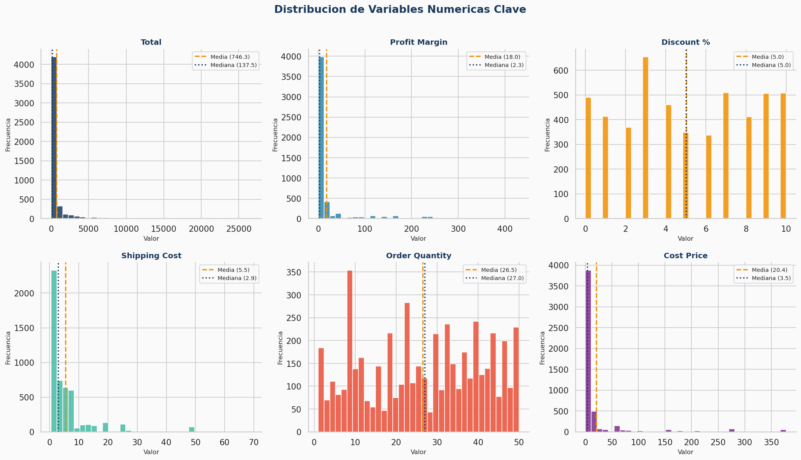
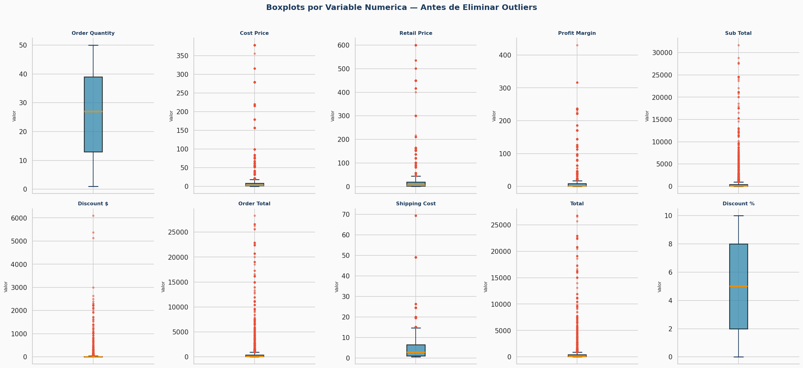
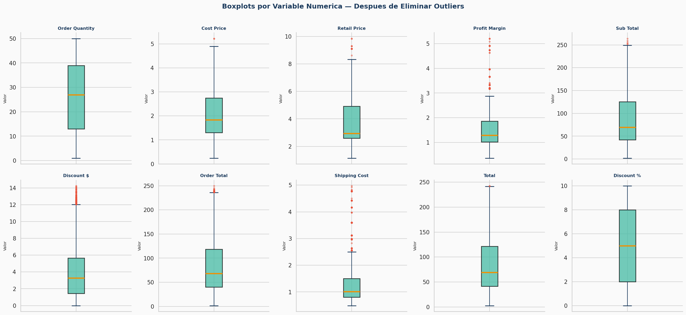
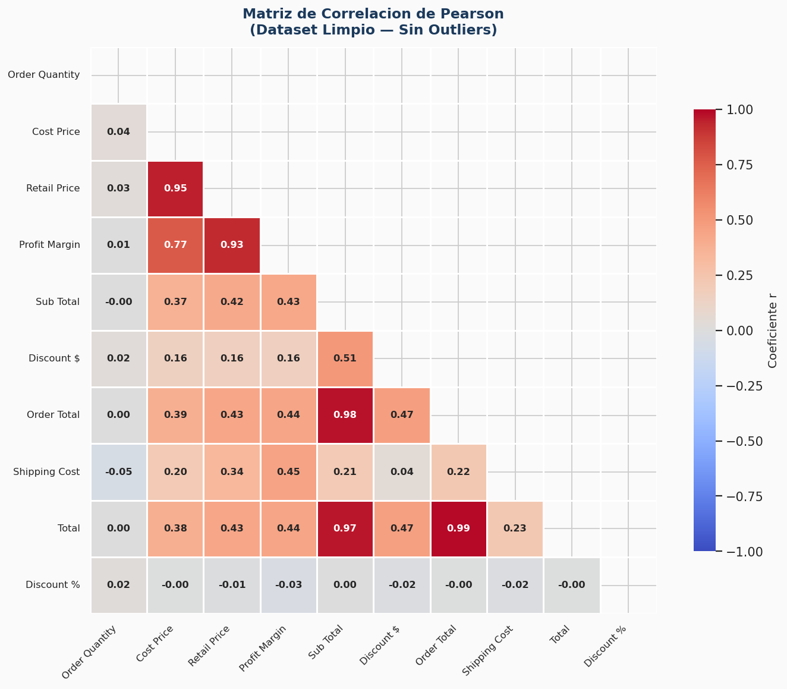

# Retail Sales EDA — Análisis Exploratorio de Ventas

**Proyecto de portafolio | Python · Pandas · Seaborn · Scipy**

---

## ¿Qué problema resuelve este análisis?

Una empresa retail tiene 5.000 registros de órdenes de venta y necesita responder preguntas concretas antes de tomar decisiones comerciales:

- ¿Qué categorías de producto generan el mayor volumen de órdenes?
- ¿Existen pedidos atípicos que distorsionen las métricas de rentabilidad?
- ¿Qué variables están correlacionadas y cuáles son redundantes para futuros modelos?
- ¿Cómo se distribuye el uso de los canales de envío?

Este análisis responde esas preguntas con estadística descriptiva, detección de outliers y análisis de correlación.

---

## Hallazgos clave

**Concentración de producto**
- **Office Supplies** representa el **79% de las órdenes**, mientras que Furniture apenas alcanza el 3.4%. El negocio depende estructuralmente de una sola categoría.

**Pedidos atípicos**
- Se detectaron outliers en todas las variables monetarias, consistentes con cuentas corporativas de alto volumen. Tras su tratamiento, la desviación estándar se redujo significativamente — las métricas promedio pasaron a reflejar el comportamiento real de la mayoría de clientes.

**Logística**
- El canal **Regular Air** concentra el **84.7% de los envíos**. La dependencia de un solo canal representa un riesgo operativo y una oportunidad de negociación de tarifas.

**Correlación entre variables**
- Las variables de precio unitario, descuento y total de orden están altamente correlacionadas. Esto indica redundancia estructural útil para simplificar cualquier modelo predictivo futuro.

---

## Visualizaciones

**Distribución de variables clave**



**Detección de outliers — antes y después del tratamiento**




**Mapa de correlación (Pearson)**



---

## Metodología

| Etapa | Técnica aplicada |
|:------|:-----------------|
| Limpieza | Conversión de tipos, validación de nulos y duplicados |
| Estadística descriptiva | Media, mediana, moda, desv. estándar, varianza, Q1, Q3, IQR |
| Outliers | Método IQR — detección, cuantificación y eliminación |
| Correlación | Matrices Pearson y Spearman, heatmaps comparativos |

---

## Tecnologías

`Python` · `Pandas` · `NumPy` · `Matplotlib` · `Seaborn` · `Scipy`

---

## Cómo ejecutar

```bash
git clone https://github.com/Danvargast/eda-retail-sales.git
cd eda-retail-sales
pip install pandas numpy matplotlib seaborn scipy jupyter
jupyter notebook EDA_RetailSales_DanielVargas.ipynb
```

Ejecuta todas las celdas con `Kernel → Restart & Run All`.

---

## Autor

**Daniel Vargas** · Analista de Datos

> Disponible para proyectos freelance de análisis de datos, limpieza de datasets y reportes con insights de negocio.
